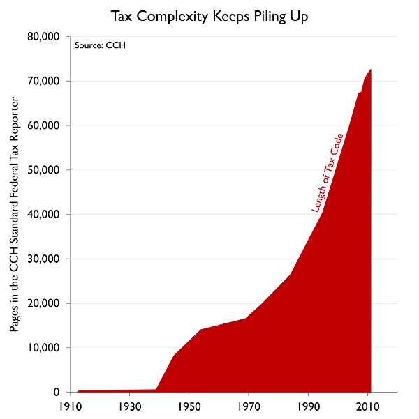

## Cost of tax compliance is rising rapidly

In 2012, US business filed 10 million federal tax returns.  Each return took 23 hours and cost $420.[^1]

When you include labor and sales taxes, a US business spends **175 hours a year** on tax compliance.[^2]

[^1]: Tax Foundation, [The Cost of Tax Compliance](https://taxfoundation.org/cost-tax-compliance/).
[^2]: Tax Foundation, [It Takes 175 hours for a U.S. Business to Comply with U.S. Taxes](https://taxfoundation.org/it-takes-175-hours-us-business-comply-us-taxes).

## Systems that hold source data now expose APIs

Ingesting, formatting and reconciling data comprises 90% of an accountant's job.  Currently, this is time-consuming, highly manual process because accountants accept data in the form of paper documents, spreadsheets, PDFs, and phone screenshots.

For many newer tech startups, this data import process can be greatly shortened because all of their relevant financial transactions are in systems that expose APIs.

* Payroll: Gusto
* Accounting: Quickbooks Online, Xero, Netsuite
* Invoice: Bill.com
* Billing: Zuora
* CRM: Salesforce
* Expenses: Abacus, Expensify
* Bank: Yodlee, Plaid APIs

## Subscription economy businesses aren't well-served by local CPA firms

### Less complexity in "bread-and-butter" CPA areas of expertise
* Subscription software and servers = no capitalization and depreciation

### More complexity in facets that CPA firms traditionally don't handle
* Sales tax for firms that sell nationally
* EU VAT for firms that sell globally
* R&D credit calculation
